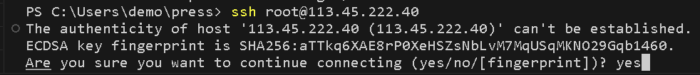
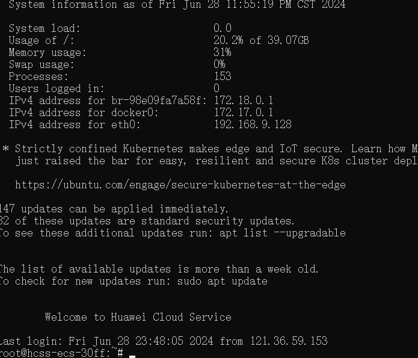

## 部署
  1. 代码提交到github
  2. ssh连接服务器

```sh
打开cmd
ssh root@<公网ip>
yes
输入密码(输入密码的时候是不可见的, 输完后按回车就行)
```


出现welcome就是成功
接下来的操作就是对服务器的命令

## Linux命令
```sh
查看目录  ls
切换目录  cd
创建文件夹  mkdir <目录名称>
显示当前路径  pwa
删除文件  rm <文件名.格式>
删除文件夹  rm -r <文件夹>
查看文件内容  more <文件名.格式>
测试网络  ping www.baidu.com
连接远程主机  ssh user@remote_host

包管理工具  yum/apt
  必要的工具: git nginx npm nvm
```
去服务器安装上面的几个包, 然后创建docs目录并在里面git clone 项目

// 不行了有点不对, bug有点多, 连接github开始就有点乱, 没想到安装nvm更乱, 还得配环境变量, 哥们弄完都不知道自己咋弄的了...